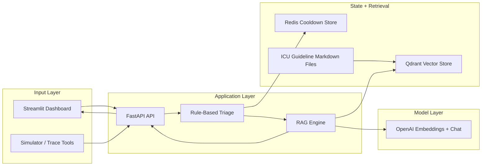
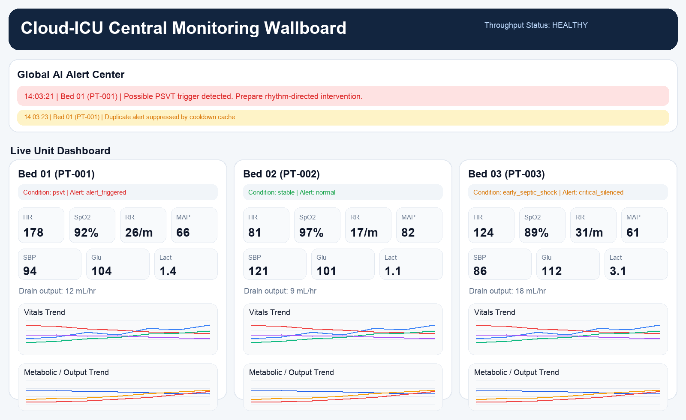
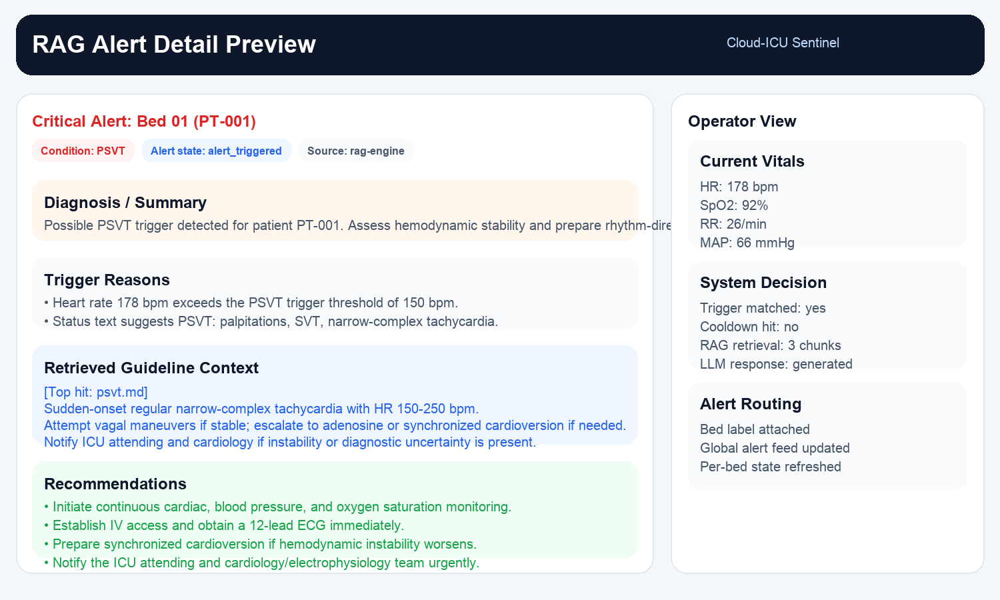

# Cloud-ICU Sentinel

Cloud-ICU Sentinel is a prototype ICU early warning system that combines:

- rule-based triage for high-risk vital sign patterns
- Redis-backed alert cooldown to reduce alert fatigue
- Qdrant-based retrieval over ICU intervention guidelines
- OpenAI-powered recommendation generation grounded in retrieved context
- a Streamlit monitoring dashboard for multi-patient visualization

## System Architecture



## Dashboard Preview



## RAG Alert Example



## What It Does

The system accepts simulated or live vital sign snapshots, checks whether a patient meets one of several high-risk conditions, suppresses duplicate alerts for the same patient and condition, retrieves the most relevant ICU guideline chunks, and generates structured recommendations.

Currently supported trigger categories include:

- acute respiratory failure
- early septic shock
- severe hypoglycemia
- PSVT
- acute pulmonary edema
- postoperative hemorrhage / hypovolemic shock

## Architecture

Main components:

- `src/agent/api.py`
  FastAPI entrypoint and orchestration layer
- `src/agent/triage.py`
  rule-based multi-condition trigger detection
- `src/agent/alert_state.py`
  Redis cooldown state management
- `src/agent/rag_engine.py`
  Qdrant retrieval + LLM recommendation generation
- `src/ingestion/vector_db_builder.py`
  batch ingestion of all markdown guidelines into Qdrant
- `src/simulator/vitals_producer.py`
  scenario-based synthetic ICU data generator
- `src/frontend/app.py`
  Streamlit dashboard for multi-bed monitoring
- `knowledge_base/`
  English ICU guideline markdown files used for retrieval

## Repository Structure

```text
cloud-icu-sentinel/
├── knowledge_base/
├── src/
│   ├── agent/
│   ├── core/
│   ├── frontend/
│   ├── ingestion/
│   ├── schemas/
│   └── simulator/
├── docker-compose.yml
├── Dockerfile.api
├── Dockerfile.ui
├── requirements.txt
└── .env.example
```

## Local Setup

### 1. Install dependencies

```bash
pip install -r requirements.txt
```

### 2. Create an environment file

```bash
cp .env.example .env
```

Then update `.env` with your own values, especially:

- `OPENAI_API_KEY`
- `QDRANT_URL`
- `REDIS_URL`

### 3. Start infrastructure

```bash
docker compose up -d qdrant redis
```

### 4. Build the vector index

```bash
PYTHONPATH=. python3 src/ingestion/vector_db_builder.py
```

### 5. Start the API

```bash
PYTHONPATH=. uvicorn src.agent.api:app --reload --port 8000
```

### 6. Start the dashboard

```bash
PYTHONPATH=. streamlit run src/frontend/app.py
```

## Useful Commands

Preview simulated cases:

```bash
PYTHONPATH=. python3 src/simulator/vitals_producer.py --scenario sepsis --preview 3 --json
```

Trace a single case end to end:

```bash
PYTHONPATH=. python3 src/agent/trace_case.py \
  --patient-id demo-sepsis-001 \
  --heart-rate 124 \
  --spo2 91 \
  --respiratory-rate 30 \
  --systolic-bp 84 \
  --map 61 \
  --glucose 112 \
  --lactate 3.1 \
  --drain-output 18 \
  --status "sepsis with hypotension and rising lactate"
```

## Notes

- This repository intentionally does not include secrets.
- Use `.env.example` as the template for local configuration.
- `.env`, `.gcloud-config`, and other local runtime artifacts are ignored by Git.

## Status

This project is a prototype intended for experimentation, demos, and architecture exploration. It is not a production medical device and should not be used for real clinical decision-making.
